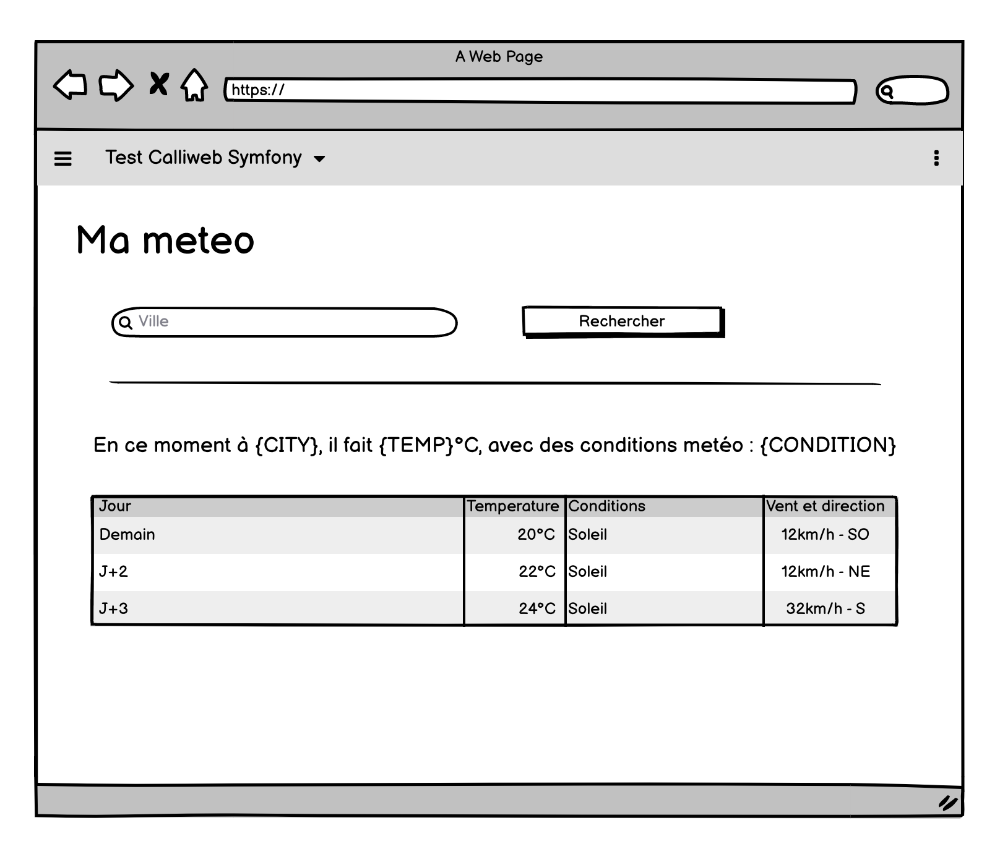
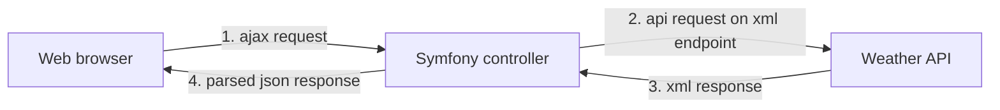

# Test PHP Symfony - Interfacage à une API, manipulation de données, création d'un controller ajax

## Prérequis - environnement de dev

Utiliser votre environnement de dev fetiche, ou celui mis a dispo via docker/docker-compose :

- cloner le projet
- installer Docker, docker-compose
- executer `docker-compose up --build`
- se connecter au conteneur (docker ps, puis docker exec -it {nom_conteneur} sh)
- installer les dependances composer
- aller sur http://localhost:8002

## Objectifs

L'objectif est d'afficher une page de recherche et affichage de resultats météo, calqué sur ce wireframe :

Créez un compte gratuit et une clé API ici : https://www.weatherapi.com/signup.aspx

Documentation : https://www.weatherapi.com/docs/

Le chargement de la recherche et météo devra etre fait en ajax. 
L'appel API à weatherapi et le parsing seront fait par Symfony, en utilisant les methodes api en XML, et renvoyé en json (en ne parsant que le necessaire pour fournir une reponse digeste) au navigateur par une requete AJAX. 

Prevoir les cas ou aucun resultat ne serait trouvé.

Pousser votre travail dans un repo privé, et nous envoyer une invitation pour le consulter, sur thomas.nares@calliweb.fr

## L'évaluation

Seront évalués :

- la qualité du code
- la rigueur
- le respect du PSR
- le respect de la semantique HTML
- les choix de conception
- les choix de libs, bundles Symfony utilisés
- l'organisation du code

Un entretien en visio sera demandé pour la restitution (resultat et parcours commenté du code, et echanges ensemble).

## Conseillé, pas obligatoire

Un peu de mise en forme via un theme bootstrap, tailwind, ou autre sera appreciée, bien que non jugé sur cet exercice purement back. 

En revanche, le html produit devra etre propre, et l'organisation niveau vues bien structurée (layouts, extends, blocks, ...). # lab-CWeb
